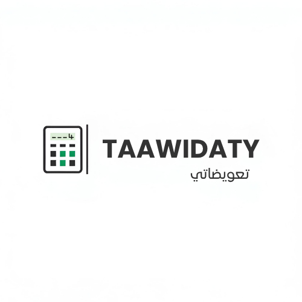

<div align="center">
  
  
  # TAAWIDATY | تعويضاتي
  
  ### 🏥 Calculateur de Remboursement des Médicaments - Maroc
  
  **Designed & Developed by [BENTALBA ZAKARIA](https://github.com/salma1-create)**
  
  [](https://reactjs.org/)
  [](https://www.typescriptlang.org/)
  [](https://vitejs.dev/)
  [](https://tailwindcss.com/)
  [](LICENSE)

  [🌐 Demo](https://dawa-calcul-plus.vercel.app) • [📖 Documentation](#-features) • [🤝 Contributing](#-contributing)

</div>

---

## 📋 Table of Contents

- [Overview](#-overview)
- [Features](#-features)
- [Tech Stack](#-tech-stack)
- [Getting Started](#-getting-started)
- [Project Structure](#-project-structure)
- [Usage](#-usage)
- [Bilingual Support](#-bilingual-support)
- [FAQ System](#-faq-system)
- [Contributing](#-contributing)
- [License](#-license)

---

## 🎯 Overview

**TAAWIDATY** (تعويضاتي) is a comprehensive web application designed to help Moroccan citizens calculate medication reimbursement rates for both **CNOPS** and **CNSS** insurance systems. With an extensive database of **5,709+ medications** and full bilingual support (French/Arabic), it provides instant, accurate reimbursement calculations.

### 🎬 Why TAAWIDATY?

- **Transparency**: Know your reimbursement rates before visiting the pharmacy
- **Comprehensive**: Access to complete medication databases for both insurance systems
- **Accessible**: Full bilingual support with RTL (Right-to-Left) for Arabic
- **User-Friendly**: Modern, responsive interface optimized for all devices
- **Educational**: Detailed FAQ sections to understand insurance processes

---

## ✨ Features

### 🔍 Medication Search
- **Instant Search**: Real-time filtering across 5,709+ medications
- **Dual Database**: Separate databases for CNOPS and CNSS
- **Smart Filtering**: Search by medication name with instant results
- **Detailed Information**: View medication codes, prices, and reimbursement rates

### 💰 Reimbursement Calculator
- **Automatic Calculation**: Instant computation of reimbursement amounts
- **Clear Breakdown**: 
  - Public Price (Prix Public)
  - Reimbursement Rate (Taux de Remboursement)
  - Reimbursed Amount (Montant Remboursé)
  - Patient Responsibility (Reste à Charge)

### 🌍 Bilingual Interface
- **Full Language Support**: Complete French and Arabic translations
- **RTL Support**: Proper Right-to-Left rendering for Arabic
- **Persistent Language**: Language preference saved across sessions
- **Seamless Switching**: Toggle between languages instantly

### ❓ Comprehensive FAQ
- **CNOPS FAQ**: 15 detailed questions covering all aspects of CNOPS insurance
- **CNSS FAQ**: 15 detailed questions covering all aspects of CNSS insurance
- **Bilingual Content**: All FAQs available in French and Arabic
- **Easy Navigation**: Quick access from landing page with multiple entry points

### 📱 Responsive Design
- **Mobile-First**: Optimized for smartphones and tablets
- **Desktop Enhanced**: Rich experience on larger screens
- **Accessibility**: Built with a11y best practices using Radix UI

---

## 🛠 Tech Stack

### Frontend Framework
- **React 18.3.1**: Modern UI with hooks and context
- **TypeScript 5.8.3**: Type-safe development
- **Vite 5.4.19**: Lightning-fast build tool and dev server

### UI & Styling
- **Tailwind CSS 3.4.17**: Utility-first styling
- **shadcn/ui**: High-quality accessible components
- **Radix UI**: Primitive components for accessibility
- **Lucide React**: Beautiful icon system

### Routing & State
- **React Router DOM 6.30.1**: Client-side routing
- **Context API**: Global state management for language
- **LocalStorage**: Persistent user preferences

### Development Tools
- **ESLint**: Code quality and consistency
- **PostCSS**: CSS transformations
- **Python 3.9+**: Data processing scripts

---

## 🚀 Getting Started

### Prerequisites

- **Node.js** (v18 or higher) - [Install with nvm](https://github.com/nvm-sh/nvm#installing-and-updating)
- **npm** or **yarn** or **bun**

### Installation

```bash
# Clone the repository
git clone https://github.com/salma1-create/dawa-calcul-plus.git

# Navigate to project directory
cd dawa-calcul-plus

# Install dependencies
npm install
# or
yarn install
# or
bun install
```

### Development

```bash
# Start development server
npm run dev
# or
yarn dev
# or
bun dev

# Open http://localhost:5173 in your browser
```

### Build for Production

```bash
# Create optimized production build
npm run build

# Preview production build locally
npm run preview
```

### Linting

```bash
# Run ESLint
npm run lint
```

---

## 📁 Project Structure

```
dawa-calcul-plus/
├── public/
│   ├── logos/
│   │   └── TAAWIDATY.png          # Main logo
│   └── robots.txt                  # SEO configuration
├── src/
│   ├── components/
│   │   ├── ui/                     # shadcn/ui components
│   │   ├── AdBanner.tsx           # Advertisement component
│   │   ├── LanguageToggle.tsx     # Language switcher
│   │   ├── ResultCard.tsx         # Medication result display
│   │   └── SearchInput.tsx        # Search component
│   ├── contexts/
│   │   └── LanguageContext.tsx    # Global language state
│   ├── data/
│   │   ├── medications-cnops.json # CNOPS medication database (5,709 entries)
│   │   ├── medications-cnss.json  # CNSS medication database (5,709 entries)
│   │   └── medicationsLoader.ts   # Async data loader
│   ├── hooks/
│   │   ├── use-mobile.tsx         # Mobile detection hook
│   │   ├── use-toast.ts           # Toast notifications
│   │   └── useLanguage.ts         # Language hook export
│   ├── lib/
│   │   ├── faqData.ts             # FAQ content (FR/AR)
│   │   ├── translations.ts        # UI translations (FR/AR)
│   │   └── utils.ts               # Utility functions
│   ├── pages/
│   │   ├── Index.tsx              # Landing page & calculator
│   │   ├── FaqCnops.tsx           # CNOPS FAQ page
│   │   ├── FaqCnss.tsx            # CNSS FAQ page
│   │   └── NotFound.tsx           # 404 page
│   ├── App.tsx                     # Root component & routing
│   └── main.tsx                    # Application entry point
├── package.json
├── vite.config.ts                  # Vite configuration
├── tailwind.config.ts              # Tailwind configuration
└── tsconfig.json                   # TypeScript configuration
```

---

## 📖 Usage

### 1. Select Insurance Type

Choose between **CNOPS** or **CNSS** on the landing page.

### 2. Search for Medication

Type the medication name in the search field. Results appear instantly as you type.

### 3. View Reimbursement Details

Click on any medication to see:
- **Code**: Official medication code
- **Prix Public**: Retail price in MAD
- **Taux**: Reimbursement percentage
- **Montant Remboursé**: Amount covered by insurance
- **Reste à Charge**: Amount you pay

### 4. Access FAQ

Click "FAQ" buttons to learn more about:
- Reimbursement procedures
- Required documents
- Coverage limits
- Processing times
- And much more...

---

## 🌐 Bilingual Support

### Language Toggle

Click the language toggle button (🇫🇷/🇦🇪) in the top-right corner to switch between French and Arabic.

### RTL Support

When Arabic is selected:
- **Direction**: Automatic RTL (Right-to-Left) layout
- **Typography**: Optimized Arabic fonts
- **UI Elements**: Mirrored for natural reading flow

### Translation Coverage

- ✅ All UI elements
- ✅ Button labels
- ✅ Form placeholders
- ✅ Error messages
- ✅ FAQ content (30 questions total)
- ✅ Informational text

---

## ❓ FAQ System

### CNOPS FAQ (15 Questions)

Covers topics including:
- Online access and registration
- Document requirements
- Coverage limits and rates
- Chronic disease management
- Reimbursement timelines
- And more...

### CNSS FAQ (15 Questions)

Covers topics including:
- Beneficiary eligibility
- Third-party payment system
- Reimbursement procedures
- Coverage calculations
- Required documentation
- And more...

**Access**: Available from landing page via FAQ Quick Access Banner and Help Cards

---

## 🤝 Contributing

We welcome contributions! Here's how you can help:

### Reporting Issues

Found a bug or have a suggestion? [Open an issue](https://github.com/salma1-create/dawa-calcul-plus/issues)

### Pull Requests

1. Fork the repository
2. Create your feature branch: `git checkout -b feature/amazing-feature`
3. Commit your changes: `git commit -m 'Add some amazing feature'`
4. Push to the branch: `git push origin feature/amazing-feature`
5. Open a Pull Request

### Development Guidelines

- Follow TypeScript best practices
- Maintain consistent code style (use ESLint)
- Write meaningful commit messages
- Test thoroughly before submitting
- Update documentation as needed

---

## 📊 Medication Data

### Data Sources

- **CNOPS Database**: 5,709 medications with official codes and rates
- **CNSS Database**: 5,709 medications with official codes and rates

### Data Format

```json
{
  "code": "3400893580103",
  "name": "DOLIPRANE 1000 MG CPR BT/8",
  "publicPrice": 12.50,
  "reimbursementRate": 70
}
```

### Updating Data

To update medication databases:

```bash
# Process new medication data
python process_medications_cnops.py
python process_medications_cnss.py

# Validate JSON structure
node test_medications.mjs
```

---

## 📄 License

This project is licensed under the **MIT License** with the following conditions:

### ✅ What you CAN do:
- Use the code freely for personal or commercial projects
- Modify and distribute the code
- Use it as a learning resource

### ⛔ What you CANNOT do:
- **Use the name "TAAWIDATY" (تعويضاتي)** - The brand name is protected and proprietary
- Remove or modify author attribution

### Attribution Required:
All copies or substantial portions of the software must include:
- **Original Author**: BENTALBA ZAKARIA
- Link to this repository

---

## 👨‍💻 Author

**BENTALBA ZAKARIA**

- Design & Development: Complete UI/UX and full-stack implementation
- GitHub: [@salma1-create](https://github.com/salma1-create)
- Year: 2025

*This project was conceived, designed, and built from scratch by BENTALBA ZAKARIA to serve the Moroccan community.*

---

## 🙏 Acknowledgments

- **CNOPS**: For insurance framework reference
- **CNSS**: For insurance framework reference
- **shadcn/ui**: For beautiful component library
- **Radix UI**: For accessible primitives
- **Lucide**: For icon system

---

## 📞 Contact

**Author & Maintainer**: BENTALBA ZAKARIA

**Repository**: [dawa-calcul-plus](https://github.com/salma1-create/dawa-calcul-plus)

---

<div align="center">
  
  ### ⭐ Star us on GitHub — it motivates us a lot!
  
  Made with ❤️ for the Moroccan community by **BENTALBA ZAKARIA**
  
  **TAAWIDATY** © 2025 BENTALBA ZAKARIA
  
</div>
